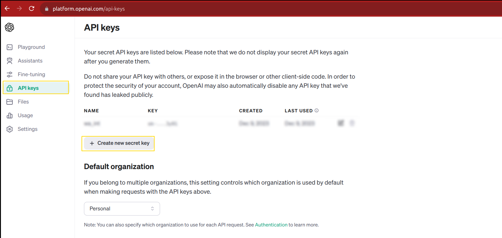
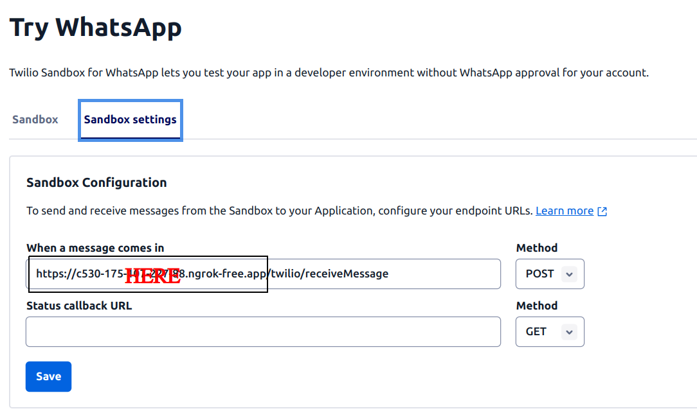

# Connect GPT with whatsapp
Hi everyone, this repository is to connect your whatsapp with openai's ChatGPT 3.5 turbo. This repositor is updated(changed) version of (https://github.com/RajKKapadia/YouTube-WhatsApp-OpenAI). 


### Requrirements for this project

1. OpenAI API key, if you dont have an account you can create one for free and generate a key, OpenAI allows some dollars initially that are enough for practice purpose [here](https://openai.com/).

2. Twilio account [here](https://console.twilio.com/), you need twilio account SID and TOKEN, you need to connect your twilio to your whatsapp by following the instructions provided there.
 
3. NGROK (You need to install and configure NGROK), create a free account on ngrok [here](https://ngrok.com/). 

### How to use it
To replicate the work of this repository and run it locally, you need to follow these steps:
* create a `.env` file inside the root directory, create these environmental variables:
    ```
    TWILIO_ACCOUNT_SID='twilio account sid'
    TWILIO_AUTH_TOKEN='twilio authentication token'
    OPENAI_API_KEY='open_api key'
    FROM='whatsapp:+14155238886'
    ```
This FROM variable in the .env file is same for the Twilio WhatsApp Sandbox.
* create virtual environment and install requirements mentioned in `requirements.txt`
    -> if on ubuntu:
    ```
    python3 -m virtualenv env_integ
    source env_integ/bin/activate
    pip install -r requirements.txt
    ```
* run server from python as well as NGROK (port should be same), in two different terminals
    ```
    python run.py
    ```

    ```
    ngrok http (port)
    ```
* copy the ngrok provided url and paste it in sandbox settings.
    
* after adding link, write `/twilio/receiveMessage`
* send message from your whatsapp to twilio and you will get response from chatgpt3.5 turbo.

# About me
I am Israr Ahmed, passionate about AI/DS/ML/DL. I work on tasks related to computer vision, nlp, gen ai, ml ops and also on resful apis like Flask or Fast Api.

* [LinkedIn](https://www.linkedin.com/in/ahmedisrar919/)
